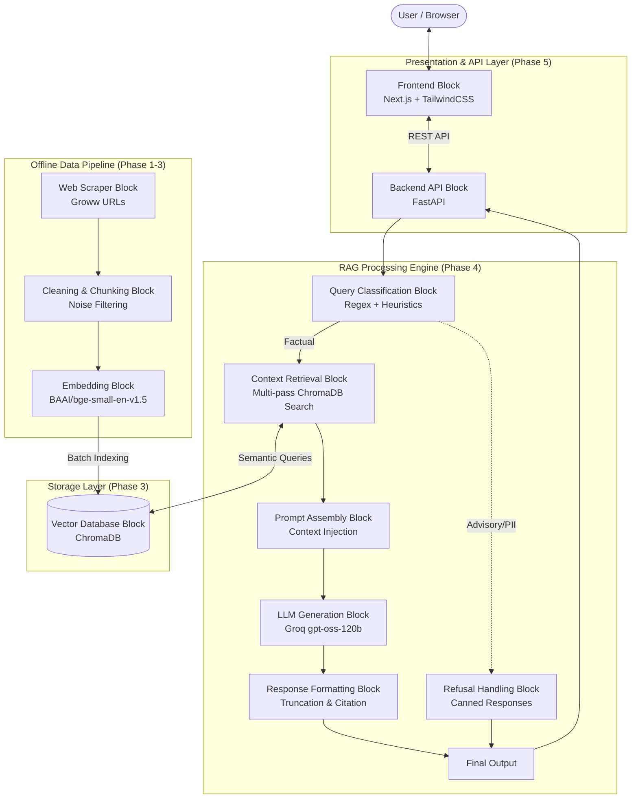

# Mutual Fund FAQ Assistant Architecture

## Block Diagram

## Brief Explanation

This block diagram represents the modular architecture of the facts-only Mutual Fund FAQ Assistant:

1.  **Offline Data Pipeline (Bottom):** Handles the background ingestion of data. The **Web Scraper Block** extracts raw HTML from Groww scheme pages, which is passed to the **Cleaning & Chunking Block** to filter out UI noise and preserve key facts. The **Embedding Block** converts this clean text into dense vectors.
2.  **Storage Layer:** The **Vector Database Block** (ChromaDB) securely stores the embedded chunks along with their metadata for rapid similarity-based retrieval.
3.  **RAG Processing Engine (Middle):** The core intelligence of the application. 
    *   The **Query Classification Block** intercepts non-factual queries (advisory or PII), routing them to the **Refusal Handling Block**.
    *   Valid factual queries proceed to the **Context Retrieval Block**, which fetches the most relevant key facts from ChromaDB.
    *   The context is injected into the **Prompt Assembly Block** and sent to the **LLM Generation Block**.
    *   Finally, the **Response Formatting Block** guarantees the output is concise (≤ 3 sentences) and contains strict source citations.
4.  **Presentation & API Layer (Top):** The **Backend API Block** (FastAPI) exposes the RAG engine to the web, while the **Frontend Block** (Next.js) provides a polished, interactive chat interface for the user.
